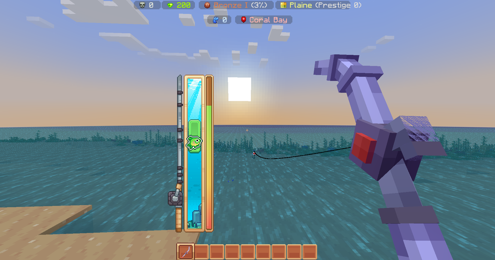

# 🎣 La Pêche

## <mark style="color:yellow;">E</mark><mark style="color:yellow;">**n quoi consiste ce système ?**</mark> 

Le système de pêche de OneBlock transforme complètement la pêche traditionnelle de Minecraft. Désormais, lorsque tu attrapes un poisson, un affichage customisé apparaît :

### <mark style="color:yellow;">Affichage</mark> 

1. **Lancer la ligne** : clic gauche pour lancer.
2. **Attendre qu’un poisson morde** : Quand tu vois l'interface de pêche ouverte, c'est l'heure d'attraper le poison !
3. **Explication** :
   * Un poisson se déplace de haut en bas dans une barre verticale.
   * Tu contrôles une **barre verte** en maintenant ou relâchant le clic gauche :
     * **Maintenir** : la barre monte.
     * **Relâcher** : elle descend.
   * Le but est de **garder le poisson dans la barre verte** jusqu’à ce que la jauge de progression à droite soit pleine.

:bulb: Certains poissons sont très vifs et difficiles à suivre, ils changent de direction très souvent.

En **pêchant sur l'archipel**, vous avez **80% de chance** de pêcher un **poisson customisé.**

<figure><figcaption>
En pêchant un poisson customisé, vous avez une interface customisée, plus le poisson est rare, plus il sera difficile à pêcher !
</figcaption></figure>

### <mark style="color:yellow;">D</mark><mark style="color:yellow;">**es poissons customisés ?**</mark> 

Oui, lors de la pêche, tu peux attraper un total de **51 poissons personnalisés**, répartis en **5 catégories de rareté**, allant de **commune** à **légendaire**. Une autre particularité : chaque poisson peut avoir entre **1 et 3 étoiles**, indiquant sa qualité.

### <mark style="color:yellow;">Les poissons étoiles</mark>

Les **poissons** sont classés par **rareté** et peuvent également **être étoilés**.

**Chaque poisson** peut-être standard ou doté d'une **étoile de bronze**, **d'argent** ou **d'or.**

✔ Vous avez attrapé un(e) **Saumon argenté (★☆☆)** avec succès.\
✔ Vous avez attrapé un(e) **Crabe (★★☆)** avec succès.\
✔ Vous avez attrapé un(e) **Fugu (★★★)** avec succès.

Les étoiles **influencent le prix de vente** du poisson : plus il a d’étoiles, plus sa valeur est élevée !

### <mark style="color:yellow;">U</mark><mark style="color:yellow;">**tilité des poissons ?**</mark>

Les poissons servent de prérequis pour progresser dans vos maîtrises ! Ils peuvent aussi être vendus à un prix très intéressant. Certains poisson peuvent également être échangés avec d'autres joueurs afin de les aider à compléter leurs propres maîtrises.


Profite de ce mécanisme pour rendre chaque session de pêche encore plus amusante et gratifiante !

